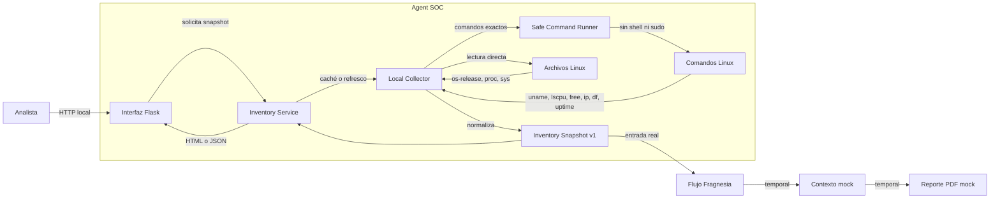

# Arquitectura de Agent SOC

## Alcance actual

La primera feature productiva es el inventario del mismo host Linux donde se ejecuta Agent SOC. Su responsabilidad termina al entregar un snapshot normalizado y trazable. No determina exposición a vulnerabilidades y no modifica el sistema.

## Estrategia de evolución compatible

El producto debe permanecer navegable de inicio a fin durante toda la implementación. Cada feature real reemplaza únicamente al mock de su etapa y conserva el contrato utilizado por las etapas siguientes. Los mocks restantes continúan activos y se etiquetan de manera visible para evitar que se interpreten como resultados reales.

Esta regla permite evolucionar el sistema sin perder la demo integrada: inventario real, contexto simulado y reporte transicional pueden coexistir hasta que los módulos de contexto y reporte sean sustituidos.

## Vista de componentes

## Componentes

| Componente | Responsabilidad | Restricción principal |
|---|---|---|
| Interfaz Flask | Presentar HTML y API JSON | No ejecuta comandos directamente |
| Inventory Service | Caché de 30 segundos y refresco | Una recolección concurrente a la vez |
| Local Collector | Orquestar y normalizar evidencia | Tolera fallos parciales |
| Safe Command Runner | Ejecutar comandos del sistema | Tuplas exactas en allowlist, sin shell |
| Inventory Snapshot | Contrato entre módulos | Esquema versionado `1.0` |

## Flujo

1. Flask solicita un snapshot al servicio.
2. El servicio devuelve el dato cacheado si tiene menos de 30 segundos.
3. Cuando corresponde recolectar, el collector consulta archivos estándar y comandos locales.
4. El runner rechaza cualquier comando que no coincida exactamente con su allowlist.
5. El collector normaliza resultados y registra éxito y duración de cada comando.
6. Flask presenta el mismo contrato como HTML o JSON.

## Contrato de seguridad

- Operación local y de solo lectura.
- Sin interpolación de entrada del usuario.
- Sin `shell=True`, `sudo` ni comandos arbitrarios.
- Resolución de ejecutables limitada a rutas estándar del sistema.
- Timeout individual de tres segundos.
- Bind predeterminado a `127.0.0.1`.
- La traza no almacena la salida cruda de los comandos.
- Los fallos parciales se incluyen como advertencias sin inventar valores.

## Datos recolectados

El snapshot contiene identidad del host, sistema operativo, kernel, hardware, CPU, RAM, swap, disco raíz, uptime, gateway, interfaces, direcciones IP, trazas y advertencias. `schema_version` permitirá evolucionar el contrato sin romper al futuro agente de vulnerabilidades.

## Decisiones y trade-offs

- Se prefieren herramientas estándar de Linux para evitar una dependencia adicional como `psutil`.
- El inventario es local por diseño. El soporte para servidores remotos deberá implementarse como otro adaptador que produzca el mismo `InventorySnapshot`.
- Los datos se conservan solo en memoria. La persistencia con identificador de análisis llegará con el módulo de evaluación de Fragnesia.
- La dirección IP y los datos de hardware son sensibles; no se recomienda publicar esta interfaz directamente en Internet.

## Evolución prevista

El siguiente reemplazo compatible ampliará `InventorySnapshot v1` con la evidencia específica requerida por CVE-2026-46300: paquete del kernel, versión fuente Debian, kernel realmente cargado, módulos relevantes y reinicio pendiente. El stepper, el contexto mock y el PDF seguirán funcionando durante ese cambio. Después, el mock de contexto será sustituido por la correlación real con NVD y Debian Security Tracker.
