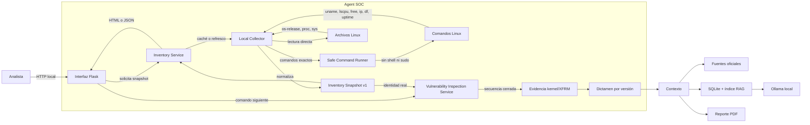

# Arquitectura de Agent SOC

## Alcance actual

Agent SOC detecta el host Linux donde se ejecuta y realiza una inspección local de solo lectura para determinar la aplicabilidad por versión de CVE-2026-46300. El inventario y la inspección son módulos separados; contexto y reporte consumen sus contratos sin ejecutar comandos por cuenta propia.

## Estrategia de evolución compatible

El producto debe permanecer navegable de inicio a fin durante toda la implementación. Cada feature real reemplaza únicamente al mock de su etapa y conserva el contrato utilizado por las etapas siguientes. Los módulos restantes continúan activos mediante sus contratos compatibles hasta ser reemplazados.

Esta regla permite evolucionar el sistema sin perder el flujo integrado: inventario, inspección y contexto ya producen evidencia verificable, mientras el reporte conserva el contrato que será sustituido en la siguiente etapa.

## Vista de componentes

## Componentes

| Componente | Responsabilidad | Restricción principal |
|---|---|---|
| Interfaz Flask | Presentar HTML y API JSON | No ejecuta comandos directamente |
| Inventory Service | Caché de 30 segundos y refresco | Una recolección concurrente a la vez |
| Local Collector | Orquestar y normalizar evidencia | Tolera fallos parciales |
| Safe Command Runner | Ejecutar comandos del sistema | Tuplas exactas en allowlist, sin shell |
| Inventory Snapshot | Contrato entre módulos | Esquema versionado `1.0` |
| Vulnerability Inspection Service | Ejecutar la secuencia y emitir el dictamen | Orden fijo, estado aislado por análisis |
| Inspection Summary | Contrato para contexto y reporte | Resultado y evidencia normalizados |
| Context Analysis Service | Ingesta, normalización, RAG y agentes | Ocho operaciones secuenciales |
| Ollama local | Embeddings e inferencia de agentes | Bind exclusivo a `127.0.0.1:11434` |
| Context Summary | Evidencia consolidada para reporte | Fuentes, enlaces y valores verificables |

## Flujo

1. Flask solicita un snapshot al servicio.
2. El servicio devuelve el dato cacheado si tiene menos de 30 segundos.
3. Cuando corresponde recolectar, el collector consulta archivos estándar y comandos locales.
4. El runner rechaza cualquier comando que no coincida exactamente con su allowlist.
5. El collector normaliza resultados y registra éxito y duración de cada comando.
6. Al seleccionar el host se crea un identificador de análisis y se inicializa la inspección.
7. La interfaz habilita un solo comando a la vez y presenta su salida en la terminal.
8. El último comando compara la versión instalada con la versión corregida aplicable.
9. El resumen se entrega a contexto y reporte sin cambiar el contrato del flujo.
10. Contexto descarga cuatro fuentes, registra hashes y normaliza los documentos en SQLite.
11. Ollama genera embeddings, recupera los fragmentos relacionados y ejecuta los agentes de triaje y correlación.
12. Un validador determinista vuelve a comparar las versiones antes de producir `Context Summary`.

## Secuencia de inspección de CVE-2026-46300

La secuencia consulta sistema operativo, kernel activo, paquetes instalados, versión candidata, configuración XFRM/ESP, módulos cargados y disponibles y reinicio pendiente. Finalmente clasifica el host como `CORRECTED`, `POTENTIALLY_VULNERABLE` o `INSUFFICIENT_EVIDENCE`.

El interruptor del pie reinicia la inspección y conserva la identidad del servidor mientras alterna la evidencia coherente del kernel evaluado. En ambos estados, contexto ejecuta la misma ingesta, recuperación RAG, inferencia y validación.

## Contrato de seguridad

- Operación local y de solo lectura.
- Sin interpolación de entrada del usuario.
- Sin `shell=True`, `sudo` ni comandos arbitrarios.
- Resolución de ejecutables limitada a rutas estándar del sistema.
- Timeout individual de entre tres y cinco segundos según el módulo.
- Bind predeterminado a `127.0.0.1`.
- La traza no almacena la salida cruda de los comandos.
- Los fallos parciales se incluyen como advertencias sin inventar valores.
- La ruta HTTP sólo acepta identificadores predefinidos y exige el orden de la secuencia.
- El estado de cada ejecución se separa mediante un identificador aleatorio almacenado en sesión.

## Datos recolectados

El snapshot contiene identidad del host, sistema operativo, kernel, hardware, CPU, RAM, swap, disco raíz, uptime, gateway, interfaces, direcciones IP, trazas y advertencias. `schema_version` permite evolucionar el contrato sin romper el módulo de vulnerabilidades.

## Decisiones y trade-offs

- Se prefieren herramientas estándar de Linux para evitar una dependencia adicional como `psutil`.
- El inventario es local por diseño. El soporte para servidores remotos deberá implementarse como otro adaptador que produzca el mismo `InventorySnapshot`.
- Los datos y la evidencia de cada identificador de análisis se conservan sólo en memoria durante la ejecución del servicio.
- La dirección IP y los datos de hardware son sensibles; no se recomienda publicar esta interfaz directamente en Internet.

## Evolución prevista

El siguiente reemplazo compatible se concentrará en la composición completa del reporte y consumirá `Context Summary` sin cambiar la navegación ni el identificador del análisis.
